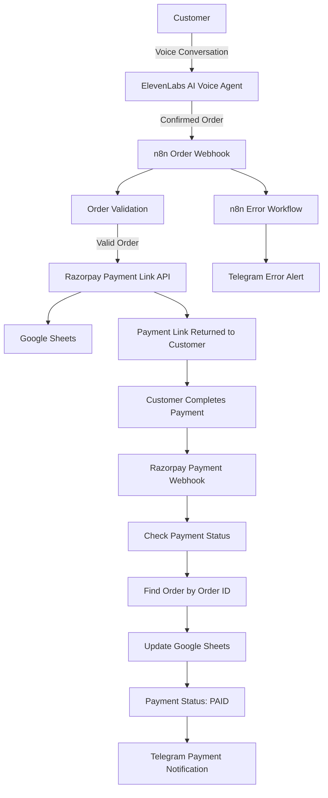

# Grandma's Kitchen — AI Voice Ordering & Payment Automation

A Telugu-first AI voice ordering system that enables customers to place food orders through a natural conversational voice agent while automating order validation, Razorpay payment-link generation, Google Sheets order tracking, payment-status updates, Telegram notifications, and workflow error alerts.

## 🚀 Overview

**Grandma's Kitchen — AI Voice Ordering & Payment Automation** is an AI-powered ordering system built to automate the food-ordering process for a small business.

The project combines conversational AI, voice interaction, workflow automation, REST APIs, payment processing, webhooks, Google Sheets, and Telegram notifications into a single end-to-end workflow.

The system allows a customer to speak naturally with an AI voice agent, select products, specify quantities, provide customer details, confirm the order, and receive a Razorpay payment link.

Once payment is completed, Razorpay sends a webhook event to n8n, which updates the corresponding order as `PAID` in Google Sheets and sends a payment notification to the business owner through Telegram.

## 🎯 Problem Statement

Small food businesses often manage orders manually through phone calls or messages.

A typical manual process can involve:

Customer message → Manual order taking → Manual total calculation → Manual payment request → Manual payment verification → Manual order recording

This project automates these repetitive steps using AI and workflow automation.

The automated process becomes:

Customer voice → AI ordering agent → Order validation → Payment link generation → Order recording → Payment verification → Business notification

This provides a more structured, traceable, and automated ordering workflow.

## ✨ Key Features

### 🎙️ Telugu AI Voice Ordering

The system provides a Telugu-first conversational ordering experience using ElevenLabs.

The AI agent can:

- Understand customer product requests
- Handle product quantities
- Support multiple products in a single order
- Collect customer name
- Collect customer phone number
- Validate the phone number
- Repeat the phone number digit-by-digit for confirmation
- Collect delivery location
- Validate the service area
- Calculate and confirm the order total
- Present the complete order summary
- Ask for explicit customer confirmation
- Submit the order only after confirmation

### 🧾 Automated Order Processing

The n8n workflow receives the confirmed order and validates the required information before continuing.

Validation includes:

- Customer name
- 10-digit phone number
- Order items
- Delivery location
- Total order amount

Invalid orders are rejected instead of continuing to payment processing.

### 💳 Razorpay Payment Automation

The system integrates with the Razorpay Payment Link API.

After the customer explicitly confirms the order, n8n creates a Razorpay Payment Link.

Each order receives a unique order ID.

The payment workflow uses two separate states:

- `CREATED` — order registered and payment link generated
- `PAID` — payment successfully confirmed through the Razorpay webhook

The system does not assume that an order is paid simply because the order was successfully created.

Payment is considered completed only when the Razorpay payment webhook reports the successful payment event.

### 📊 Google Sheets Order Tracking

Google Sheets is used for order tracking in the current implementation.

Each order contains:

| Field | Description |
|---|---|
| Customer Name | Customer's name |
| Phone | Customer phone number |
| Order Items | Products and quantities |
| Delivery Location | Customer delivery location |
| Total Amount | Total order amount |
| Order ID | Unique order identifier |
| Order Date & Time | Order creation timestamp |
| Payment Link | Razorpay payment link |
| Payment Status | `CREATED` or `PAID` |

### 🔔 Telegram Payment Notifications

After a successful payment, Razorpay sends a webhook event to the n8n payment workflow.

The workflow:

Razorpay → `payment_link.paid` → Find Order → Update Google Sheets → Send Telegram Notification

The notification can contain:

- Order ID
- Customer name
- Phone
- Order items
- Amount
- Delivery location
- Payment status

### 🚨 Automated Error Handling

A separate n8n error workflow handles workflow failures.

The process is:

n8n Error Trigger → Telegram → Business Owner Alert

This provides visibility into automation failures without requiring continuous manual monitoring.

## 🏗️ System Architecture

### 🔄 Complete Workflow

Step 1 — Customer Interaction
The customer speaks naturally with the ElevenLabs AI voice agent.

The customer can ask about available products, prices, quantities, and place an order.

Step 2 — Order Collection
The AI agent collects:

Product

Quantity

Customer name

Phone number

Delivery location

Step 3 — Phone Validation
The AI agent validates that the customer has provided a valid 10-digit phone number.

The number is repeated digit-by-digit for confirmation.

Step 4 — Order Confirmation
The AI agent provides a complete summary containing:

Customer name

Phone number

Products

Quantities

Delivery location

Total amount

The customer must explicitly confirm the order.

Step 5 — n8n Order Webhook
After confirmation, the ElevenLabs agent sends the order data to the n8n webhook.

Step 6 — Order Validation
n8n validates the required order fields.

Step 7 — Razorpay Payment Link
If validation succeeds, n8n creates a Razorpay Payment Link using the Razorpay REST API.

Step 8 — Google Sheets
The order information and payment link are recorded in Google Sheets with an initial payment status of CREATED.

Step 9 — Customer Payment
The payment link is returned to the AI agent and provided to the customer.

Step 10 — Razorpay Webhook
After successful payment, Razorpay sends a payment_link.paid event to the payment webhook.

Step 11 — Update Order
The payment webhook identifies the corresponding order using the Order ID and updates its payment status to PAID.

Step 12 — Telegram Notification
The business owner receives a Telegram notification confirming the successful payment.

🔄 Payment State Flow
Order Confirmed → Payment Link Created → CREATED → Customer Payment → Razorpay Webhook → Successful Payment → PAID

A failed payment does not trigger the successful-payment notification workflow.

🧠 AI Agent Capabilities
The ElevenLabs agent is designed to provide a natural Telugu-first ordering experience.

Example interaction:

Customer: నాకు ఒక Chicken Pickle కావాలి.

AI Agent: Chicken Pickle 250 గ్రాములు ₹250. ఎన్ని ప్యాకెట్లు కావాలి?

Customer: ఒకటి కావాలి.

AI Agent: మీ పేరు చెప్పండి.

Customer: Provides name.

AI Agent: మీ ఫోన్ నంబర్ చెప్పండి.

Customer: Provides phone number.

AI Agent: Phone number is repeated digit-by-digit for confirmation.

AI Agent: మీ డెలివరీ లొకేషన్ చెప్పండి.

Customer: Cumbum.

AI Agent: Provides complete order summary and total amount.

AI Agent: ఈ ఆర్డర్‌ను కన్ఫర్మ్ చేస్తున్నారా?

Customer: Yes.

AI Agent: Order is submitted and the payment link is returned.

The conversation can naturally use both Telugu and English where appropriate.

📦 Order Validation
Before submitting an order, the system validates:

Customer Name + 10-Digit Phone Number + Order Items + Delivery Location + Total Amount

Only valid orders continue to payment processing.

💰 Payment Processing
The main order workflow creates a Razorpay Payment Link.

The payment process is intentionally separated into two stages:

Order Creation
The main workflow:

Webhook → Validation → Razorpay Payment Link → Google Sheets → Response

The order is recorded with:

Payment Status: CREATED

Payment Confirmation
The separate payment webhook workflow:

Razorpay → payment_link.paid → Find Order → Update Sheet → Telegram Notification

The order is then updated to:

Payment Status: PAID

This separation prevents the system from incorrectly treating an order as paid before payment confirmation.

🔄 n8n Workflows
The repository contains three sanitized n8n workflow exports.

1. Main Order Workflow
File:

Grandmas_Chicken_Pickles.json

Workflow:

Webhook → Edit Fields → Order Validation → Razorpay Payment Link → Google Sheets → Respond to Webhook

Responsibilities:

Receive order data from the AI agent

Validate customer and order information

Generate unique Order ID

Generate Razorpay Payment Link

Store order information

Return the payment link and order information

2. Razorpay Payment Webhook
File:

Grandmas_Kitchen_Razorpay_Payment_Webhook.json

Workflow:

Razorpay Webhook → Check Payment Status → Find Order → Update Google Sheets → Telegram Notification

Responsibilities:

Receive Razorpay payment events

Check successful payment status

Identify the corresponding order

Update the order to PAID

Send payment notification

3. Error Alert Workflow
File:

Grandmas_Kitchen_Error_Alerts.json

Workflow:

n8n Error Trigger → Telegram Message

Responsibilities:

Detect workflow failures

Send automated error alerts

🛠️ Technology Stack
TechnologyPurpose	
ElevenLabs	AI voice agent and conversational interaction
n8n	Workflow automation and orchestration
Razorpay	Payment Link API and payment events
Google Sheets	Order storage and payment-status tracking
Telegram	Payment and error notifications
Webhooks	Event-driven communication
REST APIs	Service integration
ngrok	Development webhook tunneling
JSON	Workflow configuration
🌐 Development Environment
The current demonstration environment uses:

Windows

Local n8n

ngrok

ElevenLabs

Razorpay Test Mode

Google Sheets

Telegram

ngrok is used to expose local webhook endpoints during development and testing.

For production deployment, a properly secured publicly accessible n8n deployment should be used instead of relying on a temporary development tunnel.

🧪 Testing
The workflow has been tested using Razorpay Test Mode.

Testing includes:

Order creation

Payment-link generation

Google Sheets order recording

Successful payment webhook processing

Payment-status update

Telegram payment notification

Failed payment handling

n8n workflow error notification

The payment workflow was also tested with successful and failed payment scenarios to ensure that only successful payment events update an order to PAID.

🔐 Security
The public repository contains sanitized workflow exports.

The repository does not intentionally contain:

Razorpay secret keys

API keys

Telegram bot tokens

Private credentials

.env files

Production webhook secrets

Google Sheet credentials

Private service identifiers

Private identifiers in the workflow exports have been replaced with placeholders such as:

YOUR_GOOGLE_SHEET_ID

YOUR_TELEGRAM_CHAT_ID

YOUR_N8N_CREDENTIAL_ID

YOUR_N8N_WEBHOOK_ID

YOUR_N8N_INSTANCE_ID

YOUR_WORKFLOW_VERSION_ID

Never commit the following to GitHub:

.env

credentials.json

secrets.json

*.key

*.pem

API keys

Access tokens

Private credentials

The repository includes a .gitignore file to help prevent accidental commits of common secrets and local-development files.

⚙️ Setup Overview
This repository contains sanitized n8n workflow exports.

To use the workflows in another environment:

1. Install n8n
Install and configure n8n on your local machine or server.

2. Import the workflows
Import:

Grandmas_Chicken_Pickles.json

Grandmas_Kitchen_Razorpay_Payment_Webhook.json

Grandmas_Kitchen_Error_Alerts.json

3. Configure Credentials
Reconnect your own credentials for:

Google Sheets

Razorpay

Telegram

n8n integrations

4. Replace Placeholders
Replace the sanitized identifiers with your own configuration.

Examples:

YOUR_GOOGLE_SHEET_ID

YOUR_TELEGRAM_CHAT_ID

YOUR_N8N_CREDENTIAL_ID

5. Configure ElevenLabs
Create or configure an ElevenLabs conversational AI agent and connect the order webhook.

6. Configure Razorpay
Configure your Razorpay API credentials and payment webhook.

7. Configure Google Sheets
Create the required order-tracking spreadsheet with the required columns.

8. Configure Telegram
Connect a Telegram bot and configure the destination chat.

📁 Repository Structure
Grandmas-Kitchen-AI-Voice-Ordering/

├── workflows/

│ ├── Grandmas_Chicken_Pickles.json

│ ├── Grandmas_Kitchen_Razorpay_Payment_Webhook.json

│ └── Grandmas_Kitchen_Error_Alerts.json

├── .gitignore

├── LICENSE

└── README.md

📈 Project Highlights
This project demonstrates practical experience with:

Generative AI

Conversational AI

Voice AI

Prompt Engineering

Workflow Automation

REST API Integration

Payment API Integration

Webhooks

Event-driven Architecture

Data Validation

Google Sheets Integration

Telegram Automation

Error Handling

Business Process Automation

🎯 Business Automation Flow
Traditional manual workflow:

Customer Message → Manual Order Taking → Manual Total Calculation → Manual Payment Request → Manual Payment Verification → Manual Order Recording

Automated workflow:

Customer Voice → AI Agent → Automated Order Validation → Automated Payment Link → Automated Order Recording → Automated Payment Verification → Automated Notification

🚀 Future Enhancements
Planned improvements include:

WhatsApp customer integration

Production cloud deployment

Customer order-status notifications

Automated order-status tracking

Admin dashboard

Order analytics

Inventory tracking

Customer order history

Production-grade database

Improved observability and monitoring

WhatsApp integration is planned as a future enhancement and is not part of the current implementation.

📊 Future Architecture
The system can be extended into a more complete food-ordering platform:

Customer → AI Voice Agent → n8n Orchestrator → Razorpay + Database + Notifications

Notifications can include Telegram and, as a future enhancement, WhatsApp.

🏆 Skills Demonstrated
Through this project, I worked with:

AI agent design

Prompt engineering

Voice-based conversational workflows

n8n workflow automation

REST APIs

Webhook-based architecture

Razorpay Payment Links

Google Sheets integration

Telegram automation

Error-handling workflows

API request/response handling

Event-driven automation

Secure credential management

Business process automation

📌 Project Status
Status: Functional Prototype / Demonstration

Currently Implemented
Telugu AI voice ordering

Product selection

Quantity handling

Customer information collection

Phone-number validation

Order confirmation

Service-area validation

n8n order workflow

Razorpay payment-link generation

Google Sheets order storage

Razorpay payment webhook

Payment-status update

Telegram payment notification

n8n error alerts

Sanitized GitHub workflow exports

Planned
WhatsApp integration

Production deployment

Admin dashboard

Advanced analytics

Inventory management

📄 License
This project is licensed under the MIT License.

See the LICENSE file for details.

👨‍💻 Author
Vali Shaik

AI/ML Engineer | Generative AI | Automation | Python

GitHub: ValiShaik03

⭐ Project Summary
Grandma's Kitchen — AI Voice Ordering & Payment Automation demonstrates how conversational AI, workflow automation, payment APIs, webhooks, and business notifications can be combined to create an end-to-end voice-based ordering system.

Voice AI + n8n Automation + Razorpay + Google Sheets + Telegram = Automated Food Ordering System

Pasted markdown(20260920-151227).md
File
Provide me all this above content one single in one single outer Markdown file.

Done. I combined the entire provided content into one single Markdown file, without splitting it into separate Markdown sections/files.

Download the complete Grandmas_Kitchen_README.md

The source content contains the complete workflow, AI agent capabilities, Razorpay payment flow, n8n workflows, setup, security, repository structure, project highlights, future enhancements, skills, status, license, author, and project summary. 

 

Grandmas_Kitchen_README.md
Document

Grandmas_Kitchen_README.md

🔄 Complete Workflow
Step 1 — Customer Interaction
The customer speaks naturally with the ElevenLabs AI voice agent.

The customer can ask about available products, prices, quantities, and place an order.

Step 2 — Order Collection
The AI agent collects:

Product

Quantity

Customer name

Phone number

Delivery location

Step 3 — Phone Validation
The AI agent validates that the customer has provided a valid 10-digit phone number.

The number is repeated digit-by-digit for confirmation.

Step 4 — Order Confirmation
The AI agent provides a complete summary containing:

Customer name

Phone number

Products

Quantities

Delivery location

Total amount

The customer must explicitly confirm the order.

Step 5 — n8n Order Webhook
After confirmation, the ElevenLabs agent sends the order data to the n8n webhook.

Step 6 — Order Validation
n8n validates the required order fields.

Step 7 — Razorpay Payment Link
If validation succeeds, n8n creates a Razorpay Payment Link using the Razorpay REST API.

Step 8 — Google Sheets
The order information and payment link are recorded in Google Sheets with an initial payment status of CREATED.

Step 9 — Customer Payment
The payment link is returned to the AI agent and provided to the customer.

Step 10 — Razorpay Webhook
After successful payment, Razorpay sends a payment_link.paid event to the payment webhook.

Step 11 — Update Order
The payment webhook identifies the corresponding order using the Order ID and updates its payment status to PAID.

Step 12 — Telegram Notification
The business owner receives a Telegram notification confirming the successful payment.

🔄 Payment State Flow
Order Confirmed → Payment Link Created → CREATED → Customer Payment → Razorpay Webhook → Successful Payment → PAID

A failed payment does not trigger the successful-payment notification workflow.

🧠 AI Agent Capabilities
The ElevenLabs agent is designed to provide a natural Telugu-first ordering experience.

Example interaction:

Customer: నాకు ఒక Chicken Pickle కావాలి.

AI Agent: Chicken Pickle 250 గ్రాములు ₹250. ఎన్ని ప్యాకెట్లు కావాలి?

Customer: ఒకటి కావాలి.

AI Agent: మీ పేరు చెప్పండి.

Customer: Provides name.

AI Agent: మీ ఫోన్ నంబర్ చెప్పండి.

Customer: Provides phone number.

AI Agent: Phone number is repeated digit-by-digit for confirmation.

AI Agent: మీ డెలివరీ లొకేషన్ చెప్పండి.

Customer: Cumbum.

AI Agent: Provides complete order summary and total amount.

AI Agent: ఈ ఆర్డర్‌ను కన్ఫర్మ్ చేస్తున్నారా?

Customer: Yes.

AI Agent: Order is submitted and the payment link is returned.

The conversation can naturally use both Telugu and English where appropriate.

📦 Order Validation
Before submitting an order, the system validates:

Customer Name + 10-Digit Phone Number + Order Items + Delivery Location + Total Amount

Only valid orders continue to payment processing.

💰 Payment Processing
The main order workflow creates a Razorpay Payment Link.

The payment process is intentionally separated into two stages:

Order Creation
The main workflow:

Webhook → Validation → Razorpay Payment Link → Google Sheets → Response

The order is recorded with:

Payment Status: CREATED

Payment Confirmation
The separate payment webhook workflow:

Razorpay → payment_link.paid → Find Order → Update Sheet → Telegram Notification

The order is then updated to:

Payment Status: PAID

This separation prevents the system from incorrectly treating an order as paid before payment confirmation.

🔄 n8n Workflows
The repository contains three sanitized n8n workflow exports.

1. Main Order Workflow
File:

Grandmas_Chicken_Pickles.json

Workflow:

Webhook → Edit Fields → Order Validation → Razorpay Payment Link → Google Sheets → Respond to Webhook

Responsibilities:

Receive order data from the AI agent

Validate customer and order information

Generate unique Order ID

Generate Razorpay Payment Link

Store order information

Return the payment link and order information

2. Razorpay Payment Webhook
File:

Grandmas_Kitchen_Razorpay_Payment_Webhook.json

Workflow:

Razorpay Webhook → Check Payment Status → Find Order → Update Google Sheets → Telegram Notification

Responsibilities:

Receive Razorpay payment events

Check successful payment status

Identify the corresponding order

Update the order to PAID

Send payment notification

3. Error Alert Workflow
File:

Grandmas_Kitchen_Error_Alerts.json

Workflow:

n8n Error Trigger → Telegram Message

Responsibilities:

Detect workflow failures

Send automated error alerts

🛠️ Technology Stack
TechnologyPurpose	
ElevenLabs	AI voice agent and conversational interaction
n8n	Workflow automation and orchestration
Razorpay	Payment Link API and payment events
Google Sheets	Order storage and payment-status tracking
Telegram	Payment and error notifications
Webhooks	Event-driven communication
REST APIs	Service integration
ngrok	Development webhook tunneling
JSON	Workflow configuration
🌐 Development Environment
The current demonstration environment uses:

Windows

Local n8n

ngrok

ElevenLabs

Razorpay Test Mode

Google Sheets

Telegram

ngrok is used to expose local webhook endpoints during development and testing.

For production deployment, a properly secured publicly accessible n8n deployment should be used instead of relying on a temporary development tunnel.

🧪 Testing
The workflow has been tested using Razorpay Test Mode.

Testing includes:

Order creation

Payment-link generation

Google Sheets order recording

Successful payment webhook processing

Payment-status update

Telegram payment notification

Failed payment handling

n8n workflow error notification

The payment workflow was also tested with successful and failed payment scenarios to ensure that only successful payment events update an order to PAID.

🔐 Security
The public repository contains sanitized workflow exports.

The repository does not intentionally contain:

Razorpay secret keys

API keys

Telegram bot tokens

Private credentials

.env files

Production webhook secrets

Google Sheet credentials

Private service identifiers

Private identifiers in the workflow exports have been replaced with placeholders such as:

YOUR_GOOGLE_SHEET_ID

YOUR_TELEGRAM_CHAT_ID

YOUR_N8N_CREDENTIAL_ID

YOUR_N8N_WEBHOOK_ID

YOUR_N8N_INSTANCE_ID

YOUR_WORKFLOW_VERSION_ID

Never commit the following to GitHub:

.env

credentials.json

secrets.json

*.key

*.pem

API keys

Access tokens

Private credentials

The repository includes a .gitignore file to help prevent accidental commits of common secrets and local-development files.

⚙️ Setup Overview
This repository contains sanitized n8n workflow exports.

To use the workflows in another environment:

1. Install n8n
Install and configure n8n on your local machine or server.

2. Import the workflows
Import:

Grandmas_Chicken_Pickles.json

Grandmas_Kitchen_Razorpay_Payment_Webhook.json

Grandmas_Kitchen_Error_Alerts.json

3. Configure Credentials
Reconnect your own credentials for:

Google Sheets

Razorpay

Telegram

n8n integrations

4. Replace Placeholders
Replace the sanitized identifiers with your own configuration.

Examples:

YOUR_GOOGLE_SHEET_ID

YOUR_TELEGRAM_CHAT_ID

YOUR_N8N_CREDENTIAL_ID

5. Configure ElevenLabs
Create or configure an ElevenLabs conversational AI agent and connect the order webhook.

6. Configure Razorpay
Configure your Razorpay API credentials and payment webhook.

7. Configure Google Sheets
Create the required order-tracking spreadsheet with the required columns.

8. Configure Telegram
Connect a Telegram bot and configure the destination chat.

📁 Repository Structure
Grandmas-Kitchen-AI-Voice-Ordering/

├── workflows/

│ ├── Grandmas_Chicken_Pickles.json

│ ├── Grandmas_Kitchen_Razorpay_Payment_Webhook.json

│ └── Grandmas_Kitchen_Error_Alerts.json

├── .gitignore

├── LICENSE

└── README.md

📈 Project Highlights
This project demonstrates practical experience with:

Generative AI

Conversational AI

Voice AI

Prompt Engineering

Workflow Automation

REST API Integration

Payment API Integration

Webhooks

Event-driven Architecture

Data Validation

Google Sheets Integration

Telegram Automation

Error Handling

Business Process Automation

🎯 Business Automation Flow
Traditional manual workflow:

Customer Message → Manual Order Taking → Manual Total Calculation → Manual Payment Request → Manual Payment Verification → Manual Order Recording

Automated workflow:

Customer Voice → AI Agent → Automated Order Validation → Automated Payment Link → Automated Order Recording → Automated Payment Verification → Automated Notification

🚀 Future Enhancements
Planned improvements include:

WhatsApp customer integration

Production cloud deployment

Customer order-status notifications

Automated order-status tracking

Admin dashboard

Order analytics

Inventory tracking

Customer order history

Production-grade database

Improved observability and monitoring

WhatsApp integration is planned as a future enhancement and is not part of the current implementation.

📊 Future Architecture
The system can be extended into a more complete food-ordering platform:

Customer → AI Voice Agent → n8n Orchestrator → Razorpay + Database + Notifications

Notifications can include Telegram and, as a future enhancement, WhatsApp.

🏆 Skills Demonstrated
Through this project, I worked with:

AI agent design

Prompt engineering

Voice-based conversational workflows

n8n workflow automation

REST APIs

Webhook-based architecture

Razorpay Payment Links

Google Sheets integration

Telegram automation

Error-handling workflows

API request/response handling

Event-driven automation

Secure credential management

Business process automation

📌 Project Status
Status: Functional Prototype / Demonstration

Currently Implemented
Telugu AI voice ordering

Product selection

Quantity handling

Customer information collection

Phone-number validation

Order confirmation

Service-area validation

n8n order workflow

Razorpay payment-link generation

Google Sheets order storage

Razorpay payment webhook

Payment-status update

Telegram payment notification

n8n error alerts

Sanitized GitHub workflow exports

Planned
WhatsApp integration

Production deployment

Admin dashboard

Advanced analytics

Inventory management

📄 License
This project is licensed under the MIT License.

See the LICENSE file for details.

👨‍💻 Author
Vali Shaik

AI/ML Engineer | Generative AI | Automation | Python

GitHub: ValiShaik03

⭐ Project Summary
Grandma's Kitchen — AI Voice Ordering & Payment Automation demonstrates how conversational AI, workflow automation, payment APIs, webhooks, and business notifications can be combined to create an end-to-end voice-based ordering system.

Voice AI + n8n Automation + Razorpay + Google Sheets + Telegram = Automated Food Ordering System
